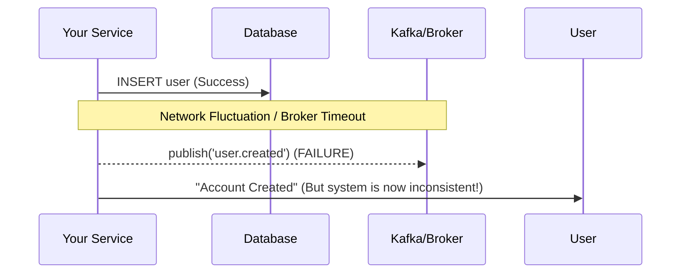
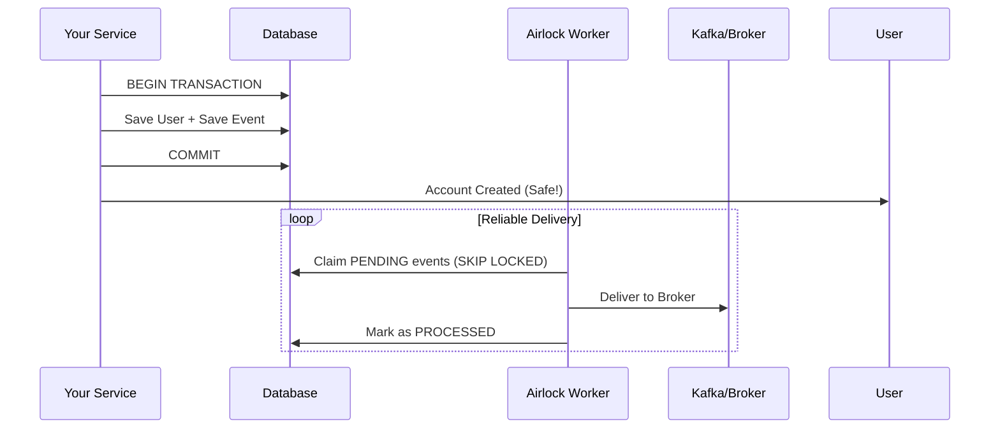

# Airlock

**Stop dropping events in your NestJS microservices.**

[](https://www.npmjs.com/package/@mohamedsaba/airlock)
[](https://opensource.org/licenses/MIT)

In distributed systems, the most dangerous line of code is the one between your database update and your event publish. If the network blips or your broker is slow, you lose data. This is the **Dual-Write Problem**.

**Airlock** is a production-grade Transactional Outbox library for NestJS. It ensures that your database and your message broker (Kafka, RabbitMQ, etc.) stay in perfect sync by making event publishing an atomic part of your business transaction.

---

## 🛑 The Problem: Silent Data Loss
When you try to save to a database and publish an event in the same block, you are gambling on the network.

```typescript
// ❌ Dangerous: If Kafka fails, the User is saved but the 'UserCreated' event is GONE.
const user = await db.save(userData);
await kafka.emit('user_created', user); 
```

### The Failure Flow


---

## ✅ The Solution: Transactional Outbox
Airlock solves this by using your database as a reliable buffer. It saves your event to a local `outbox` table in the **exact same transaction** as your business data.



---

## 🛡️ The 10 Production Invariants
Airlock isn't just a polling script. It is built around 10 strict mechanical invariants designed for high-availability environments:

1.  **Claim-Lease Model**: **Never hold a DB lock across the network.** Standard implementations use `FOR UPDATE` while talking to Kafka, which exhausts your connection pool during latency blips. Airlock claims a row, releases the SQL lock, and *then* publishes.
2.  **Poison Pill Containment**: Corrupted or un-serializable payloads are trapped and moved to a Dead Letter Queue (DLQ) immediately. The worker never crash-loops on a bad row.
3.  **Bounded Memory (OOM Bomb)**: Hard limits on `maxPayloadBytes` (e.g., 1MB) and `maxBatchBytes` (e.g., 10MB) prevent the worker from crashing when handling massive data bursts.
4.  **DB-Authoritative Time**: All scheduling and retry logic uses `CURRENT_TIMESTAMP` from the database. This eliminates issues caused by clock drift between server nodes.
5.  **Graceful Shutdown**: Native SIGTERM handling drains in-flight publishes cleanly within a configurable timeout.
6.  **Producer Idempotency**: Built-in support for idempotency keys. If your HTTP handler retries, Airlock collapses the duplicate events into one at the database level.
7.  **Serialization Guard**: Strictly enforces a JSON-safe contract. It rejects ORM entities or circular references at the API boundary, protecting you from serialization hazards.
8.  **Chunked Garbage Collection**: Processed messages are pruned in small batches using `SKIP LOCKED` to avoid table contention and hot-index locking.
9.  **Partition-Key FIFO**: (Phase 2) Guarantees strict event ordering per aggregate (e.g., events for `User:123` are processed in sequence) using Postgres advisory locks.
10. **Explicit Migrations**: No hidden `synchronize: true` magic. All schemas are version-checked at startup. Mismatch = Fatal Error.

---

## ⚙️ Technical Deep Dive

### 1. Canonical Schema (Postgres)
We use partial indexes to keep the "hot path" index size minimal. Even with 10M processed rows, the polling index remains tiny.

```sql
CREATE TABLE airlock_messages (
  id              UUID PRIMARY KEY,
  -- Routing Projects (Denormalized from CloudEvents for indexing)
  aggregate_type  VARCHAR(64)  NOT NULL,
  aggregate_id    VARCHAR(64)  NOT NULL,
  event_type      VARCHAR(128) NOT NULL,
  partition_key   VARCHAR(64)  NOT NULL, 
  
  payload         JSONB        NOT NULL, -- Full CloudEvents 1.0 Envelope
  payload_size    INT          NOT NULL, -- For OOM protection
  
  status          VARCHAR(16)  NOT NULL DEFAULT 'PENDING',
  retry_count     INT          NOT NULL DEFAULT 0,
  next_retry_at   TIMESTAMPTZ  NOT NULL DEFAULT CURRENT_TIMESTAMP,
  
  locked_by       VARCHAR(64)  NULL,
  locked_until    TIMESTAMPTZ  NULL, -- Lease expiration
  
  created_at      TIMESTAMPTZ  NOT NULL DEFAULT CURRENT_TIMESTAMP,
  processed_at    TIMESTAMPTZ  NULL,
  error_reason    TEXT         NULL
);

-- Partial index: ONLY indexes rows that need processing
CREATE INDEX idx_airlock_due ON airlock_messages (next_retry_at)
  WHERE status IN ('PENDING', 'IN_FLIGHT');
```

### 2. The Claim-Lease Flow (Step-by-Step)
Airlock decouples the Database from the Broker to prevent connection exhaustion.

1.  **The Claim**: A short transaction runs:
    ```sql
    UPDATE airlock_messages SET status='IN_FLIGHT', locked_by='worker-1', locked_until=now()+30s 
    WHERE id IN (SELECT id FROM airlock_messages WHERE status='PENDING' AND next_retry_at <= now() LIMIT 100 FOR UPDATE SKIP LOCKED)
    ```
2.  **The Release**: The transaction commits. The DB connection is released back to the pool.
3.  **The Publish**: The worker publishes to Kafka/RabbitMQ asynchronously.
4.  **The Ack**: A new transaction marks the row `PROCESSED`. If the worker crashes mid-publish, the `locked_until` lease expires, and another worker reclaims it.

---

## 🚀 Advanced Configuration

```typescript
AirlockModule.forRootAsync({
  inject: [ConfigService, DataSource],
  useFactory: (config: ConfigService, ds: DataSource) => ({
    storage: { 
      adapter: 'typeorm-postgres', 
      dataSource: ds 
    },
    broker: { 
      adapter: 'kafka', 
      brokers: config.get('KAFKA_BROKERS') 
    },
    worker: {
      concurrency: 4,          // Number of parallel workers
      batchSize: 100,          // Rows per claim cycle
      pollIntervalMs: 1000,    // Pull frequency
      leaseTtlMs: 30000,       // Lease duration (safety net for crashes)
      maxPayloadBytes: 1048576 // 1MB payload limit
    },
    retry: {
      maxRetries: 8,           // Total attempts before DLQ
      baseMs: 1000,            // Initial backoff
      maxBackoffMs: 300000,    // Cap at 5 mins
      jitter: 'full'           // Full randomized jitter
    },
    gc: {
      enabled: true,
      retentionDays: 7,        // Keep processed rows for 7 days
      chunkSize: 5000          // Delete in small batches to avoid locks
    }
  }),
})
```

---

## 🗺️ Roadmap
- **Phase 0 (Current)**: Postgres foundation, TypeORM, Claim-Lease flow.
- **Phase 1**: Kafka/RabbitMQ adapters, Exponential Backoff, DLQ, GC.
- **Phase 2**: FIFO Ordering (Advisory Locks), Prometheus Metrics, OpenTelemetry.
- **Phase 3**: Postgres LISTEN/NOTIFY (Push mode), MongoDB Adapter, Admin UI.

---

## 📄 License
MIT © [Mohamed Saba](https://github.com/mohamedsaba)
